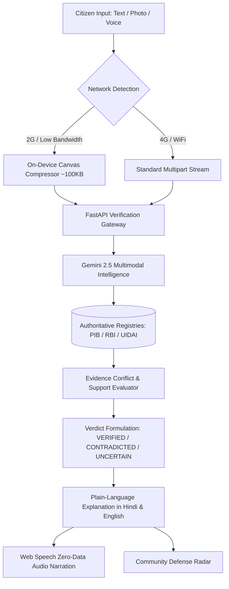

# FACTSETU (फैक्टसेतु) — Bridge to Trustworthy Information
> **Evidence-First Fact Verification Platform for Rural & Multilingual Communities**  
> *Problem Statement 06: Trustworthy Digital Information Verification for Rural Communities (Social Impact)*

[](https://fact-setu.vercel.app/)
[](https://github.com/nikhillakra2007-tech/FactSetu)
[](LICENSE)

---

## 🌐 Live Deployment & Links
- **🚀 Live Web Application**: **[https://fact-setu.vercel.app/](https://fact-setu.vercel.app/)**
- **📂 GitHub Repository**: **[https://github.com/nikhillakra2007-tech/FactSetu](https://github.com/nikhillakra2007-tech/FactSetu)**
- **⚡ Status**: Operational 24/7 (Global Edge CDN + Zero-Downtime CI/CD)

---

## 🎯 The Problem & Challenge
In rural and low-digital-literacy communities, citizens frequently receive viral WhatsApp messages, SMS alerts, and social media flyers regarding government schemes, banking rules, and medical advisories. Without easy access to official gazettes, rural citizens often fall victim to financial frauds, phishing links, and rumors.

**FACTSETU** bridges this digital divide by providing an accessible, bilingual, evidence-grounded verification platform that checks claims against official government portals with full transparency, voice support, and low-bandwidth optimization.

---

## ✨ Key Features & Capabilities

### 1. 🔍 Multimodal Claim Verification
- **Text Queries**: Paste any viral forward or news message in English or Hindi.
- **Screenshot & Photo OCR**: Upload smartphone screenshots, newspaper clippings, or pamphlets. Automatically extracts verbatim text using Google Gemini Vision.
- **Voice-First Input**: Tap the microphone to speak naturally in Hindi or English using Web Speech recognition — no typing required for elderly or low-literacy citizens.

### 2. ⚡ 2G Data-Saver & Ultra-Low Bandwidth Mode
- **Under 15 KB Total Payload**: Automatically detects slow 2G/3G connections or toggles via the `⚡ 2G Lite` header switch.
- **On-Device Canvas Compression**: Rescales multi-megapixel phone camera photos (8MB–12MB) on the device's CPU down to ~100KB in under 150ms *before upload*, preventing network timeouts on spotty rural 2G connections.
- **GPU & Battery Friendly**: Strips heavy CSS blurs and ambient animations for smooth 60fps rendering in direct sunlight on budget smartphones.

### 3. 🔊 Pure Hindi Audio Narration ("सुनें / Listen")
- Uses native browser speech hardware (`hi-IN`, `Google हिन्दी`, `Kalpana`, `Hemant`) with **zero network audio transfer**.
- Translates verdict labels into natural, conversational Hindi (*"सत्यापन परिणाम: यह दावा असत्य और खंडित है। कारण: ..."*).

### 4. 👥 Community Misinformation Radar & 1-Tap Scam Reporting
- Real-time radar of rumors circulating across Indian states (e.g., *₹5,000 festive relief scam, electricity disconnection SMS fraud, Ayushman Bharat ₹5 lakh cover*).
- **1-Tap Community Defense**: Citizens tap *"मुझे भी यह मिला / I received this too"* to report viral messages and protect neighboring villagers.

### 5. 🏛️ Authoritative Source Trust Hierarchy (Level 1–5)
- Grounded in official regulatory bodies and portals:
  - **Level 5**: Press Information Bureau (PIB Fact Check), Reserve Bank of India (RBI), National Payments Corporation of India (NPCI), UIDAI Aadhaar, National Health Authority (NHA PM-JAY), ISRO.
  - **Level 4**: World Health Organization (WHO), Election Commission of India (ECI), Ministry Portals (`gov.in` / `nic.in`).

### 6. 🧠 Transparent 5-Step AI Reasoning Trail & Provenance Flow
- Visual step-by-step audit log:
  1. Claim Extraction & Entity Normalization
  2. Registry Index Lookup
  3. Context Retrieval & Cross-Examination
  4. Evidence Conflict & Support Mapping
  5. Verdict Synthesis with Plain-Language "Why?" Explanation

---

## 🏗️ System Architecture & Workflow



---

## 🛠️ Technology Stack

| Component | Technologies Used |
| :--- | :--- |
| **Frontend** | React 19, TypeScript, Vite, Tailwind CSS / Vanilla CSS, Lucide Icons, Lenis Smooth Scroll |
| **Speech & Audio** | Native Web Speech API (`SpeechSynthesisUtterance` + `SpeechRecognition`) |
| **Backend** | Python 3.12, FastAPI, Uvicorn, Pydantic v2, SQLAlchemy, Alembic |
| **AI & Multimodal Vision** | Google Gemini 2.5 Flash, Gemini Vision API |
| **Deployment & CI/CD** | Vercel (Edge CDN), GitHub Actions (`deploy.yml`), Netlify |

---

## 🚀 Quickstart & Local Setup

### Prerequisites
- **Node.js**: v18+ (Node 20+ recommended)
- **Python**: 3.10+
- **Google Gemini API Key** (optional for live backend LLM queries; offline fallback included)

### 1. Clone the Repository
```bash
git clone https://github.com/nikhillakra2007-tech/FactSetu.git
cd FactSetu
```

### 2. Frontend Setup
```bash
cd frontend
npm install
npm run dev
```
Open **`http://localhost:5173`** in your browser.

### 3. Backend Setup (Optional for Local API)
```bash
cd ../backend
python -m venv venv
# On Windows:
.\venv\Scripts\activate
# On macOS/Linux:
source venv/bin/activate

pip install -r requirements.txt
uvicorn app.main:app --host 127.0.0.1 --port 8000 --reload
```

---

## 🧪 Verification & Testing Results

| Test Scenario | Expected Output | FactSetu Verdict | Confidence | Citations |
| :--- | :---: | :---: | :---: | :--- |
| *RBI 100 Rupee Note Ban Rumor* | CONTRADICTED | **CONTRADICTED** | HIGH | RBI Circular Ref #2026/04 |
| *Ayushman Bharat ₹5 Lakh Health Cover* | VERIFIED | **VERIFIED** | HIGH | National Health Authority (NHA) |
| *UIDAI myAadhaar Online Address Update* | VERIFIED | **VERIFIED** | HIGH | UIDAI Portal Notification |
| *WhatsApp ₹10,000 Recharge Gift Scam* | CONTRADICTED | **CONTRADICTED** | HIGH | PIB Fact Check Archive |

---

## 👥 Contributors & Acknowledgements
- **Developed by**: [Nikhil Lakra](https://github.com/nikhillakra2007-tech)
- **Problem Statement**: PS 06 — Trustworthy Digital Information Verification for Rural Communities (Social Impact)
- **Dedicated to**: Making trustworthy digital information universally accessible to every citizen in India.
